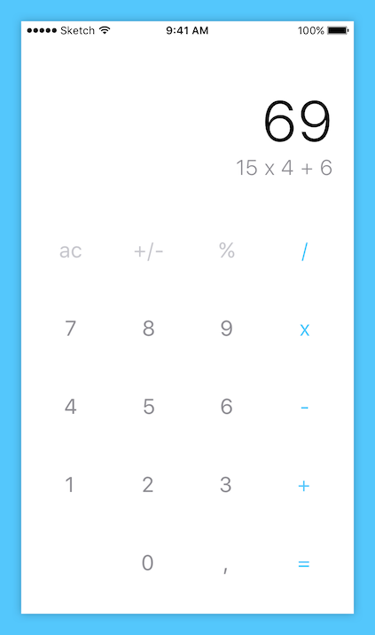

#Zappulator
A calculator app made for Zappos as part of the internship interview process.

###Concept
Zappulator is a simple and clean app designed to perform basic calculations on the go.

###Features
The assignment stated that we ought to make an app that mimics or improves upon the functionality of a standard handheld calculator. With this as the starting point, I set out to design and develop a beautiful yet simple and efficient handheld calculator for your iOS device. There are a number of features I have yet to implement, but so far the app can:

* Perform basic arithmetic such as `+` (addition), `-` (subtraction), `*` (multiplication), and `/` (division)
* Perform basic percentage calculations, such as converting the current number to a percentage, find a given percentage of the current number, and add/ subtract a given percentage to/ from the current number
* Negate numbers
* Support the input of one-decimal numbers and numbers up to as large as 1,000,000,000

###Design
When I first set to lay out the features of my app, I looked to basic handheld calculators and other similar apps for layouts that would be familiar to the user. I stuck with what can only be explained as the most standard calculator layout, and think it works well for the task. The iOS Human Interface Guidelines are always in the back of my head to make an app feel familiar to the device and user, and I stuck with those as I was designing the Zappulator. White-space is a key component in making the interface managable, and the borderless design of buttons and labels gives the entire app a more user-friendly feel. Very limited use of colors help give different weight to certain parts, and overall I'm rather happy with how it turned out.

Because I was unable to implement the expression label the way I wanted to, it has been hidden for the time being. This is the current design as screenshotted from an actual device:

###How to use
If you are familiar with basic (non graphical/ mathematical) calculators, getting used to Zappulator should be easy. You input a number using the dark gray numerical keypad, press an operator, and input a second number. From here you can keep using operators and inputting numbers, or press the equals button to see the result. Pressing the comma allows you to input *one* decimal number, and you cannot return to inputting normal numbers after. Pressing the `+/-` button negates the current number on-screen, but not the calculated sum. Pressing the percentage button will turn the current number into a percentage, or you can use it as part of an expression by inputting a number, pressing `+` or `-`, a second number, and percentage. You will immediately see the value representation of the current number as a percentage of the previous, and by pressing equals you can see the total sum after adding/ subtracting said percentage. Long-pressing on the label allows you to copy the text to the clipboard. Pressing `ac` (all-clear) will reset the calculator.

###Architecture
I usually stick to the Apple recommended `MVC` (`Model-View-Controller`) architecture when developing apps. Due to the simplicity of this app, I've decided to keep all code inside the `Controller` for efficiency reasons, but if I were to keep developing this app I'd split it out into multiple parts.

###Development problems
Early on I decided I would like to figure all of this out by myself, instead of using a tutorial to guide me through it. Developing such a basic calculator wasn't nearly as easy as I thought it would be, but I never ran into any serious problems. 

###Known issues
Because of limited testing, the app is most definitely prone to bugs. There is nothing I can point out as a major issue, but they will most definitely make themselves more clear as I use this app in everyday life. 

* The app calculates the result in **order of input**, with no respect to the **order of operations**. This is a common theme among basic handheld calculators, but relatively easy to fix. 

###Future features
Due to limited availability, I have yet to implement many of the features I wanted to see in this app. Most notably is the expression label (as seen in the original design), which should display the entire expression as a string to the user. With this label in place, there is a problem on 4" devices because there is not enough space to display it all. This would also need to be fixed in that case. I'd also like to support landscape orientation, and the native usage of my app on iPads. 